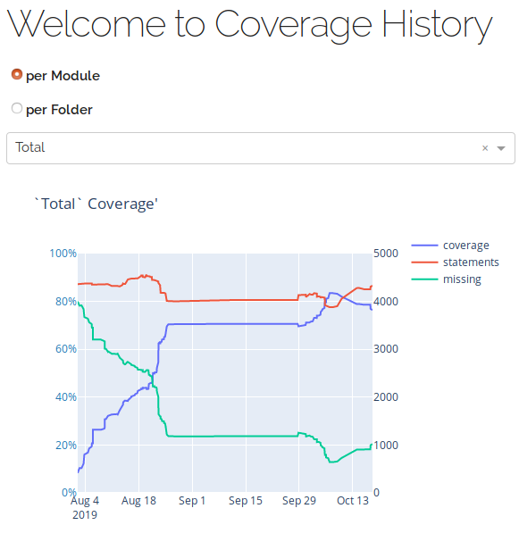

# coverage-sponge

save your test coverage progress and plot them interactively.

## The Case
``Coverage`` offers a simple but great summary inside ``index.html``
after generating html reports. This script takes these records and
inserts them into a sqlite database.

Later on you could  create (timestamp, coverage rate) plots.

## Usage
The idea is to run the script after each successful test run
with coverage and report generation.

assuming ``src`` is your main module and your tests are in ``tests/``
### run your tests
```bash
$ pytest --cov=pym --cov-branch  tests/
```
### create the coverage report
```bash
$ coverage html
$ firefox "$(pwd)/htmlcov/index.html"
```
### run the parser
```bash
$ python coverage_sponge.py
```

### plot your results
Run the viz module if you collected some history of coverage data 
```bash
$ python coverage_plotting.py
```


> powered by plotly/dash.
> but the data from SQL queries can be piped in any of your 
> favorite plotting library


## final notes
The two main modules are quite simple.
Simple to write, debug, extend or modify.
Of course, there are mature tools which you might integrate into your CI/CD pipeline like 
 - [codecov.io](https://codecov.io/)
 - [coveralls.io](https://coveralls.io/)


Different project:
 - [openstack/coverage2sql](https://github.com/openstack/coverage2sql)
